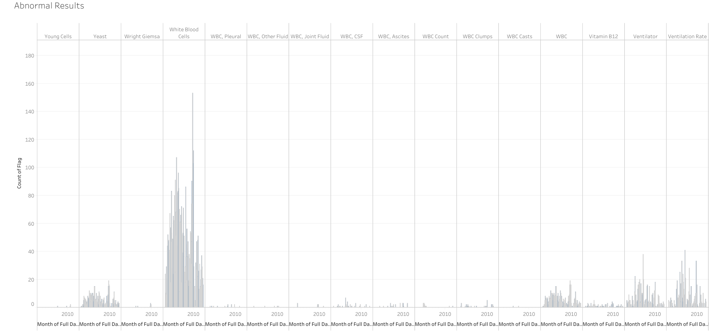
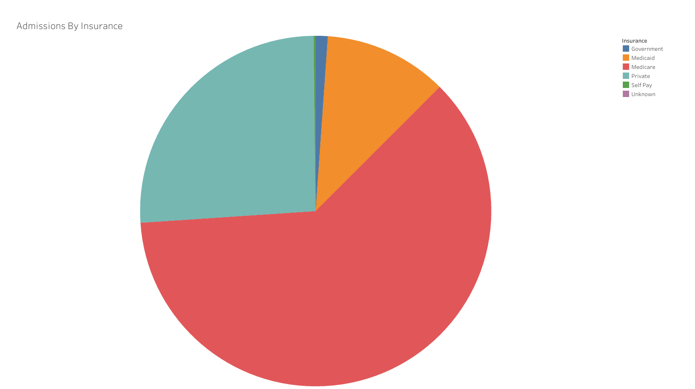
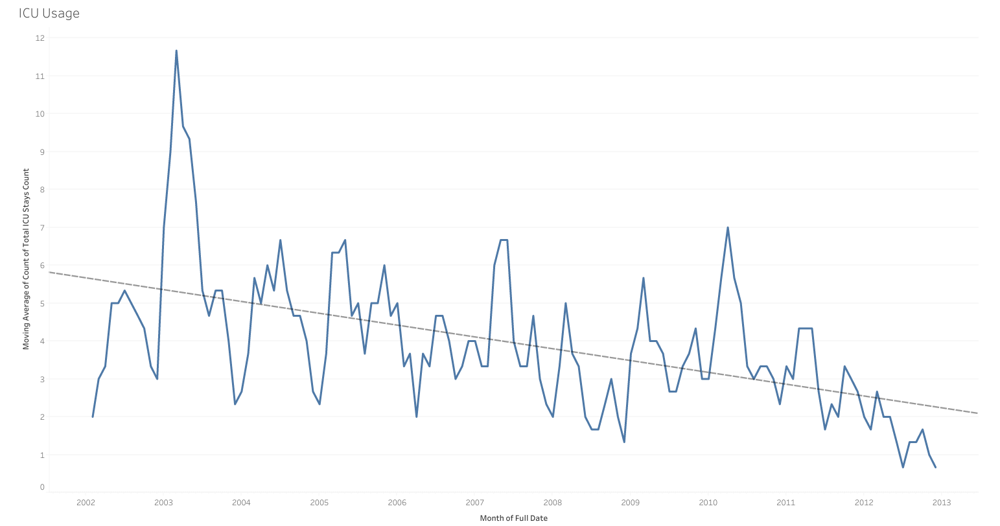
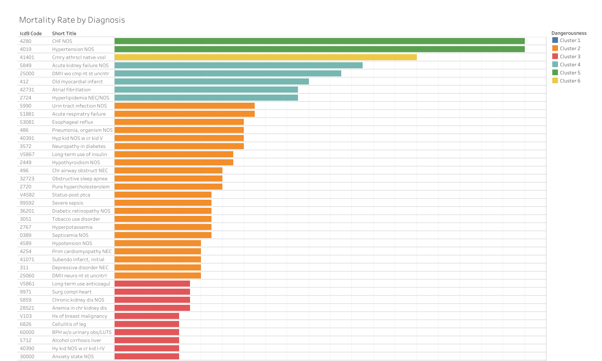

# Hospital Data Warehouse Project

This repository contains a comprehensive Data Warehouse solution built using **T-SQL**. The project ingests raw relational healthcare electronic health records (EHR), cleans and processes them through a staging area, transforms them into a star schema dimensional model, and surfaces analytical insights via BI dashboards.

---

## Project Overview

The core objective of this project is to build an analytical data platform optimizing both clinical pathways and hospital logistics. The infrastructure integrates heterogeneous source environments into structured data marts, handling historical changes via Slowly Changing Dimensions (SCD) and coordinating multi-layered ETL pipelines.

* **Database Engine:** T-SQL / Microsoft SQL Server
* **BI Layer:** Tableau Desktop

---

## Data Sources & Architecture

The analytical pipeline digests data from **two distinct transactional data sources**:

### 1. Hospital System Database

Consists of two primary operational schemas mapping the internal ecosystem:

* **Clinic Schema:** Tracks foundational administrative and operational facts.
* **ICU Schema:** Captures heavy intensive care unit metrics and clinical procedures.

### 2. Laboratory Database

* **Lab Schema:** Hosted on a separate `Laboratory` instance tracking systemic diagnostic details.

---

## Data Warehouse Model & Data Marts

The analytical layer transforms the normalized operational schemas into a multi-subject star-schema format across **two targeted Data Marts**:

```
                  +-----------------------+
                  |  Staging Layer (ETL)  |
                  +-----------+-----------+
                              |
              +---------------+---------------+
              |                               |
              v                               v
  +-----------------------+       +-----------------------+
  |  Operational Mart     |       |  Clinical Mart        |
  |  - Logistics & Flow   |       |  - Patient Outcomes   |
  +-----------------------+       +-----------------------+

```

---

## Prerequisites

1. **Download the Raw Dataset:** The architecture is configured around a demo version of the [**MIMIC-III Project**](https://mimic.mit.edu/docs/III/) with some improvements. This customized sample package is hosted and ready for use on Kaggle.
* [**Download Dataset**](https://www.kaggle.com/datasets/mehrandev/mimiciii-demo)

2. **SQL Server Management Studio (SSMS):** Ensure connectivity to an active MS SQL Server instance.

## Data Warehouse Deployment

### Phase 1: Environment Setup & Database Provisioning

1. **Create the Target Databases:**
* Execute the setup scripts to provision the four required database environments: `Hospital`, `Laboratory`, `DW_Staging`, and `DW_Hospital`.
2. **Generate Database Schemas:**
* Run the corresponding structural DDL scripts within each database to build out operational schemas (such as `Clinic`, `ICU`, and `Lab`), primary keys, and index constraints.

### Phase 2: Staging & Transactional Data Ingestion

3. **Configure the Hospital Load Script:**
* Open the hospital data load script (`Load.sql`).
* Locate the dataset directory variable at the top of the file and point it to your local folder containing the Kaggle CSV files:
```sql
DECLARE @DataDir NVARCHAR(255) = 'C:\Your\Local\Path\To\Dataset\';
```
* Execute the script to run the dynamic `BULK INSERT` loop over the clinical and intensive care tables.

4. **Configure the Laboratory Load Script:**
* Open the laboratory load script (`load.sql`).
* Inside the `FROM` clauses of the `BULK INSERT` statements, replace the placeholder strings with the explicit absolute file path to `D_LAB_ITEMS.csv` and `LAB_EVENTS.csv`:
```sql
BULK INSERT Lab.D_LAB_ITEMS FROM 'C:\Your\Path\D_LAB_ITEMS.csv' ...
```
* Execute the script to populate the `Laboratory` instance.

### Phase 3: Data Warehouse Initialization & ETL Execution

5. **Initialize Master Dimensions:**
* Switch your execution context to the `DW_Hospital` database.
* Execute the initialization procedure:
```sql
EXEC sp_Initialize_Dimensions;
```

6. **Execute Orchestration Pipeline:**
* Trigger the master orchestration wrapper to run your entire staging-to-star-schema pipeline:
```sql
EXEC sp_Run_Pipeline;
```

---

## Business Intelligence (Tableau Dashboards)

Below are some of the analytical visualizations extracted from our Tableau Reporting server; see more reports [**here**](BI/).

 

 


---

## Project Presentation & References

* **Project Presentation(Persian):** For an in-depth walkthrough of the system architecture, design patterns, and engineering decisions, view our project presentation [**here**](https://iutbox.iut.ac.ir/index.php/s/PsqciqRcSHetFdt).
* **Source Data Framework:** Built in accordance with the data schema of the [**MIMIC-III Database**](https://lcp.mit.edu/mimic-schema-spy/) project.
* **Kaggle Source Repository:** [**Download Dataset**](https://www.kaggle.com/datasets/mehrandev/mimiciii-demo)
